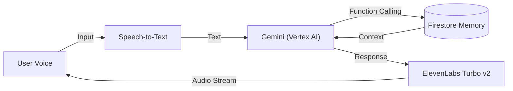

# ⚡ FlashBack: Resurrect Your Memories in Space


> **"Music triggers memories. Locations hold them."**
>
> **FlashBack** is an AR-based social platform that allows users to bury their cherished moments—songs, stories, and emotions—into physical locations ("Memory Spots"). Experience the world not just through sight, but through the emotional echoes of the past.

---

## 📖 Table of Contents
- [The Problem & Solution](#-the-problem--solution)
- [Key Features](#-key-features)
- [Tech Stack](#-tech-stack)
- [System Architecture](#-system-architecture)
- [Getting Started](#-getting-started)
- [Backend API Documentation](#-backend-api-documentation)
- [Roadmap](#-roadmap)

---

## 🎯 The Problem & Solution

**The Problem:** Current social media focuses on fleeting, real-time sharing. We lack a way to organically preserve deep, personal memories tied to specific physical spaces and music.

**The Solution:** FlashBack bridges this gap. It's a **"Time Capsule for Places."**
* **Drop:** Leave a song and a story at a specific GPS location.
* **Discover:** Pass by that spot later (or let others pass by) to unlock the memory.
* **Connect:** Feel the "Vibe" of the city through the collective memories of its people.

---

## ✨ Key Features

* **📍 Memory Spots (LBS):** Precise location-based content delivery using **Google Maps API**.
* **🎵 Music Integration:** Search and embed songs directly via **iTunes Search API**.
* **🧠 Emotional AI Curator:** An AI persona that understands your mood and recommends memories using **Google Vertex AI (Gemini)**.
* **🗣️ Voice-First Experience:** Interactive voice conversations with the app using **ElevenLabs** (Low Latency TTS).
* **📱 Progressive Web App (PWA):** Installable on iOS/Android without an app store, offering a native-like experience.

---

## 🛠 Tech Stack

### Frontend (Mobile PWA)
| Tech | Role |
| :--- | :--- |
|  | UI Framework |
|  | Type Safety & Logic |
|  | Build Tool (Lightning Fast) |
|  | App Capability (Installable) |

### Backend & AI
| Tech | Role |
| :--- | :--- |
|  | Firestore (DB) & Functions (Serverless) |
|  | Vertex AI (Gemini Pro) |
|  | Realistic Voice Synthesis (TTS) |

---

## 🏗 System Architecture

The core innovation lies in the **Voice-AI Pipeline**, designed for natural, emotional interaction.



---

## 🚀 Getting Started

### Prerequisites
- Node.js 20+ (or 24 for Functions)
- Firebase CLI
- Google Cloud Project with APIs enabled

### Installation
```bash
# Clone the repository
git clone https://github.com/nateseon/FlashBack.git
cd FlashBack

# Install frontend dependencies
cd music-map-drop
npm install

# Install backend dependencies
cd ../functions
npm install
```

---

## 📚 Backend API Documentation

### Backend – ElevenLabs TTS (Day 5)

#### Environment Variables/Secrets Setup
- For Functions deployment (recommended):  
  `firebase functions:secrets:set ELEVENLABS_API_KEY`  
  `firebase functions:secrets:set ELEVENLABS_DEFAULT_VOICE`
- For local emulator usage:  
  - Add to `functions/.env` in the following format (do not commit to Git):  
    ```
    ELEVENLABS_API_KEY=<your_key>
    ELEVENLABS_DEFAULT_VOICE=<voice_id>
    ```  
  - Or use `firebase functions:secrets:access ELEVENLABS_API_KEY` to retrieve and inject as environment variable before starting the emulator.

#### HTTPS Function: POST /tts
- File: `functions/src/index.ts`  
- Request body (JSON): `{ "text": string, "voiceId"?: string }`  
  - If `voiceId` is not provided, `ELEVENLABS_DEFAULT_VOICE` will be used.
- Response: `audio/mpeg` MP3 binary

#### Local Emulator Testing
```bash
cd functions
npm run build
cd ..
firebase emulators:start --only functions
```
Test:
```bash
curl -X POST \
  -H "Content-Type: application/json" \
  -d '{"text":"Hello, FlashBack ElevenLabs test."}' \
  http://localhost:5001/<project-id>/us-central1/tts \
  --output local-test.mp3
```

#### Production Testing
```bash
cd functions
npm run build
cd ..
firebase deploy --only functions:tts

curl -X POST \
  -H "Content-Type: application/json" \
  -d '{"text":"Production TTS test."}' \
  https://us-central1-<project-id>.cloudfunctions.net/tts \
  --output prod-test.mp3
```

---

### Backend – Gemini AI Integration (Day 8-10)

#### Environment Setup
- Vertex AI automatically authenticates using the GCP project where Firebase Functions runs.
- No additional API key setup required (uses GCP project default authentication).

#### HTTPS Function: POST /ai/ask

**Request Body (JSON):**
```json
{
  "text": "Are there any sad songs here?",
  "audioUrl": "https://...",  // Optional (STT implemented - Day 11-12)
  "location": {
    "latitude": 37.5665,
    "longitude": 126.9780
  }
}
```

**Response (JSON):**
```json
{
  "answerText": "There are a few songs with a sad mood nearby...",
  "tracks": [
    {
      "trackName": "Song Title",
      "artistName": "Artist Name",
      "mood": "sad",
      "coverUrl": "https://...",
      "previewUrl": "https://...",
      "userText": "I listened to this song while...",
      "distance": 0.5
    }
  ],
  "ttsAudioUrl": "data:audio/mpeg;base64,..."  // Optional
}
```

**Features:**
- Uses Gemini 1.5 Flash model
- Responds with an emotional DJ persona
- Queries location-based music drops from Firestore (5km radius)
- Converts response text to ElevenLabs TTS (returns base64-encoded audio URL)

#### Local Testing
```bash
cd functions
npm run build
cd ..
firebase emulators:start --only functions,firestore
```

Test request:
```bash
curl -X POST \
  -H "Content-Type: application/json" \
  -d '{
    "text": "What songs are nearby?",
    "location": {
      "latitude": 37.5665,
      "longitude": 126.9780
    }
  }' \
  http://localhost:5001/<project-id>/us-central1/aiAsk
```

#### Deployment
```bash
cd functions
npm run build
cd ..
firebase deploy --only functions:aiAsk
```

#### API Contract (For Frontend)

**Endpoint:** `POST /ai/ask`

**Request:**
- `text` (string, optional): User question text
- `audioUrl` (string, optional): Audio URL (STT implemented - Day 11-12)
- `location` (object, required): `{ latitude: number, longitude: number }`

**Response:**
- `answerText` (string): AI response text
- `tracks` (array): Recommended track list (max 5 tracks)
- `ttsAudioUrl` (string, optional): TTS audio URL (base64 data URL)

---

### Backend – STT Integration (Day 11-12)

#### Speech-to-Text Pipeline

**Complete Pipeline:**
```
[Audio URL] → [Google Cloud Speech-to-Text] → [Transcribed Text] 
→ [Gemini AI] → [Response Text] → [ElevenLabs TTS] → [Audio Stream]
```

#### Features
- **Google Cloud Speech-to-Text** integration
- Supports Korean (ko-KR) and English (en-US) with automatic language detection
- Optimized for web audio formats (WEBM_OPUS, 48kHz)
- Parallel processing: STT and Firestore queries run simultaneously for better latency

#### Audio Format Support
- **Encoding**: WEBM_OPUS (default from MediaRecorder API)
- **Sample Rate**: 48kHz
- **Languages**: Korean (primary), English (fallback)
- **Model**: `latest_long` (optimized for longer audio)

#### Performance Optimization (Day 13-14)
- **Parallel Processing**: STT transcription and Firestore queries run in parallel
- **Target Latency**: < 3 seconds end-to-end
- **Error Handling**: Graceful fallback to text input if STT fails

#### Testing Audio Input
```bash
# Test with audio URL
curl -X POST \
  -H "Content-Type: application/json" \
  -d '{
    "audioUrl": "https://example.com/audio.webm",
    "location": {
      "latitude": 37.5665,
      "longitude": 126.9780
    }
  }' \
  http://localhost:5001/<project-id>/us-central1/aiAsk
```

#### Environment Setup
- Google Cloud Speech-to-Text API must be enabled in your GCP project
- No additional API keys required (uses GCP project default authentication)
- Enable API: `gcloud services enable speech.googleapis.com`

---

## 🗺 Roadmap

- [x] **Week 1**: Foundation & Data Layer
  - [x] Firebase setup & Firestore schema
  - [x] Google Maps integration
  - [x] Music drop creation & retrieval
  - [x] ElevenLabs TTS integration

- [x] **Week 2**: AI Integration
  - [x] Gemini AI integration with emotional DJ persona
  - [x] Function Calling for Firestore queries
  - [x] Speech-to-Text pipeline
  - [x] Voice-first experience optimization

- [ ] **Week 3**: AR & Polish
  - [ ] AR view with camera overlay
  - [ ] UI/UX polish & animations
  - [ ] PWA deployment on Vercel
  - [ ] Demo video production

---

## 📄 License

MIT License - see LICENSE file for details

---

## 🙏 Acknowledgments

Built with ❤️ for preserving memories in space and time.
